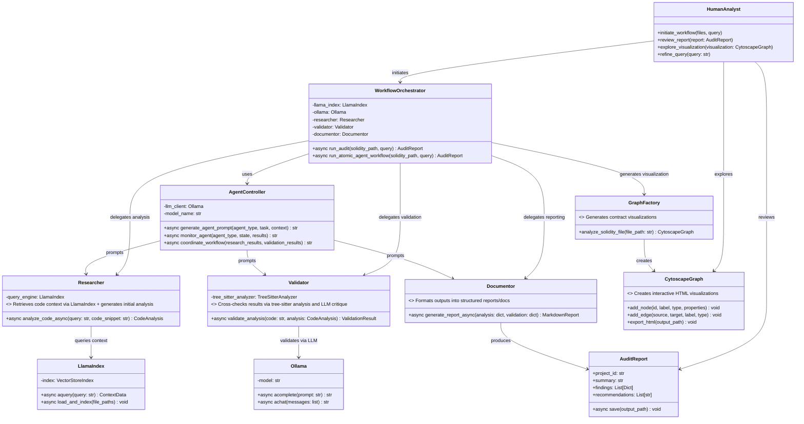

# Finite Monkey: Smart Contract Audit & Analysis Framework

## Overview

Finite Monkey is an advanced framework for comprehensive smart contract analysis, audit, and verification. It employs a fully asynchronous architecture with atomic agents orchestrating workflows powered by LlamaIndex and Ollama LLM integration.
I'll bw working on re-merging our other enhancements ASSAP back into @BradMoonUESTC ASAP it's been busy and it took me a minute to decide on an appropiate relativly future proof framework.  

More or less we have 2 differing agentic frameworks, the inner set is derived from llama-index and it is used to form the innner set of well-defined, yet feature rich interactions, likely where the 
majority of execution flow will be naturally. The outer set of agent's are the managment layer, which encourages, evaluates, reports and composes more elaborate interactions with the world that is less
structured.  You could also say there is a 3'rd executive agent framework (human in the looop!) so that would be were moving the code-query and otehr tooling into you're hands for extensive
prototyping, research and developkent.   Looking forward to expanding functionality.


The system enables:
- Deep code analysis of smart contracts
- Vulnerability detection and validation
- Comprehensive report generation
- Interactive visualization of contract relationships
- Multi-file analysis for complex projects
- Human-in-the-loop review facilitation# Finite Monkey: Smart Contract Audit & Analysis Framework


### Solidity Analysis Agent System (asyc finite monkey engine)


## Architecture

The framework follows these key architectural principles:

### Fully Asynchronous Execution
- All operations are non-blocking
- Parallel processing where possible
- Efficient handling of complex analysis tasks
   - Atomic agents (Researcher, Validator, Documentor)
   - WorkflowOrchestrator for coordinating the workflow
   - LlamaIndex integration for efficient code retrieval
   - Ollama adapter for LLM integration
   - SQLAlchemy database for persistence

### Atomic Agent Design
- Independent, specialized agents for specific tasks
- Coordinated through a central orchestrator
- Prompt-driven interactions
   - Integration with tree-sitter for static analysis
   - Interactive visualization of contracts and their relationships
   - Multi-file analysis support
   - Comprehensive reporting system
   - Unified command-line interface

### Vector Database Integration
- LlamaIndex for efficient code context retrieval
- Semantic search for related code sections
- Function call tree generation

### LLM Integration
- Ollama for local LLM inference
- Contextual prompting for specialized analysis
- Cross-validation of findings
   - Clean separation of concerns with atomic agents
   - Modular design for easy extension
   - Prompt-driven interactions with LLMs
   - Database persistence for tracking state


## System Entity Relationship

```mermaid
erDiagram
    %% Core Entities
    HUMAN_ANALYST ||--o{ WORKFLOW : initiates
    HUMAN_ANALYST ||--o{ QUERY : refines
    HUMAN_ANALYST ||--o{ REPORT : reviews
    HUMAN_ANALYST ||--o{ VISUALIZATION : interacts_with
    
    %% Main Framework Components
    WORKFLOW_ORCHESTRATOR ||--|{ ATOMIC_AGENT : coordinates
    WORKFLOW_ORCHESTRATOR ||--|| AGENT_CONTROLLER : uses
    WORKFLOW_ORCHESTRATOR ||--o{ REPORT : generates
    WORKFLOW_ORCHESTRATOR ||--o{ VISUALIZATION : produces
    
    %% Atomic Agents
    ATOMIC_AGENT {
        string type "researcher|validator|documentor"
        string state "idle|working|completed"
        string model_name "Model used for this agent"
    }
    
    RESEARCHER_AGENT }|--|| LLAMA_INDEX : queries
    VALIDATOR_AGENT }|--|| OLLAMA : validates_with
    DOCUMENTOR_AGENT }|--|| REPORT : formats
    
    %% Agent Controller
    AGENT_CONTROLLER ||--|{ PROMPT : generates
    AGENT_CONTROLLER ||--|{ FEEDBACK : monitors
    
    %% Input / Knowledge
    SOLIDITY_FILE }|--|| CODE_ANALYSIS : analyzed_into
    SOLIDITY_FILE }|--|| VISUALIZATION : visualized_as
    SOLIDITY_FILE }|--|| LLAMA_INDEX : indexed_in
    
    %% Analysis Components
    CODE_ANALYSIS ||--|| VALIDATION_RESULT : verified_by
    CODE_ANALYSIS {
        string project_id "Unique identifier"
        array vulnerabilities "List of identified issues"
        string summary "Brief analysis summary"
        string detailed_analysis "Full textual analysis"
        date timestamp "When analysis was performed"
    }
    
    VALIDATION_RESULT {
        boolean confirmed "Whether analysis is valid"
        array false_positives "Incorrectly identified issues"
        array missed_vulnerabilities "Additional issues found"
        string feedback "Validator feedback"
    }
    
    %% Outputs
    REPORT {
        string project_name "Name of the analyzed project"
        array findings "List of security findings"
        array recommendations "List of remediation steps"
        string summary "Executive summary"
        string detailed_report "Full markdown report"
    }
    
    VISUALIZATION {
        string html_output "Interactive visualization file"
        array nodes "Contract components"
        array edges "Relationships between components"
        string type "cytoscape|other"
    }
    
    %% LLamaIndex Components
    LLAMA_INDEX ||--|{ VECTOR_STORE : contains
    LLAMA_INDEX ||--|| QUERY_ENGINE : provides
    
    VECTOR_STORE {
        string index_id "Unique identifier"
        array document_ids "List of document identifiers"
        string index_type "Type of index used"
    }
    
    QUERY_ENGINE {
        string mode "default|semantic"
        number similarity_top_k "Number of results to return"
    }
    
    %% LLM Integration
    OLLAMA {
        string model "Name of the LLM model"
        number temperature "Creativity parameter"
        number timeout "Request timeout in seconds"
    }
    
    PROMPT {
        string agent_type "Type of agent this prompt is for"
        string task "Specific task description"
        string context "Additional context information"
        string system_message "Agent role instructions"
    }
    
    FEEDBACK {
        string agent_type "Type of agent being monitored"
        string state "Current state"
        string content "Feedback content"
    }
    
    %% Human Workflow
    WORKFLOW {
        string type "audit|visualization|full"
        array files "List of files to analyze"
        string query "User's analysis request"
        date timestamp "When workflow was initiated"
    }
    
    QUERY {
        string text "User's query"
        string type "general|specific|follow-up"
    }
    
    %% Solidity Specific
    SOLIDITY_FILE {
        string file_path "Path to the file"
        array contracts "List of contracts in file"
        string content "Source code"
    }
    
    CONTRACT {
        string name "Contract name"
        array functions "List of functions"
        array state_variables "List of state variables"
        array events "List of events"
        array inherited_contracts "List of parent contracts"
    }
    
    SOLIDITY_FILE ||--|{ CONTRACT : contains
    CONTRACT ||--|{ FUNCTION : has
    CONTRACT ||--|{ STATE_VARIABLE : contains
    CONTRACT ||--|{ EVENT : emits
    CONTRACT }|--o{ CONTRACT : inherits
    
    FUNCTION {
        string name "Function name"
        string visibility "public|private|internal|external"
        array parameters "List of parameters"
        array modifiers "List of modifiers applied"
        boolean is_payable "Whether function accepts ETH"
        boolean is_view "Whether function is read-only"
    }
    
    FUNCTION }|--o{ FUNCTION : calls
    FUNCTION }|--o{ STATE_VARIABLE : uses
    FUNCTION }|--o{ EVENT : emits
    
    STATE_VARIABLE {
        string name "Variable name"
        string type "Data type"
        string visibility "public|private|internal"
    }
    
    EVENT {
        string name "Event name"
        array parameters "List of parameters"
    }
```



## Key Components



## Workflow Sequence


## Human-in-the-Loop Architecture

Finite Monkey is designed with a human-centered approach, placing the security analyst at the core of a multi-layered system of specialized agents:

```mermaid
graph TD
    %% Core - Human Analyst
    Human["👤 Security Analyst<br/>(Human-in-the-Loop)"] 
    
    %% Middle Layer - LlamaIndex Integration
    subgraph "Context Layer (LlamaIndex)"
        VectorStore["📊 Vector Store<br/>Code Embeddings"]
        CodeRetrieval["🔍 Context Retrieval<br/>Semantic Search"]
        QueryEngine["⚙️ Query Engine<br/>Contextualized Info"]
    end
    
    %% Inner Layer - Atomic Agents
    subgraph "Atomic Agents Layer"
        Researcher["🔬 Researcher<br/>Initial Analysis"]
        Validator["✅ Validator<br/>Verification & Cross-check"]
        Documentor["📝 Documentor<br/>Report Generation"] 
    end
    
    %% Outer Layer - Management
    subgraph "Management Layer"
        WorkflowOrchestrator["🎭 Workflow Orchestrator<br/>Coordination & Sequencing"]
        AgentController["🎮 Agent Controller<br/>Prompt Engineering"]
        Visualization["📊 Graph Factory<br/>Interactive Visualization"]
    end
    
    %% Input/Output
    SolidityCode["📄 Solidity Contracts<br/>Input Files"]
    SecurityReport["📋 Security Report<br/>Findings & Recommendations"]
    ContractGraph["🕸️ Contract Graph<br/>Interactive Visualization"]
    
    %% Connections from Human to Layers
    Human -- "Initiates Analysis" --> WorkflowOrchestrator
    Human -- "Reviews" --> SecurityReport
    Human -- "Explores" --> ContractGraph
    Human -- "Refines Queries" --> QueryEngine
    
    %% Connections to/from Management Layer
    SolidityCode --> WorkflowOrchestrator
    WorkflowOrchestrator -- "Delegates" --> Researcher
    WorkflowOrchestrator -- "Delegates" --> Validator
    WorkflowOrchestrator -- "Delegates" --> Documentor
    WorkflowOrchestrator -- "Requests" --> Visualization
    AgentController -- "Generates Prompts" --> Researcher
    AgentController -- "Generates Prompts" --> Validator
    AgentController -- "Generates Prompts" --> Documentor
    AgentController -- "Monitors" --> Researcher
    AgentController -- "Monitors" --> Validator
    AgentController -- "Monitors" --> Documentor
    
    %% Connections to/from Atomic Agents
    Researcher --> QueryEngine
    Validator --> QueryEngine
    Researcher -- "Findings" --> Validator
    Validator -- "Validated Findings" --> Documentor
    Documentor --> SecurityReport
    
    %% Connections to/from LlamaIndex
    SolidityCode --> VectorStore
    VectorStore --> CodeRetrieval
    CodeRetrieval --> QueryEngine
    
    %% Output connections
    Visualization --> ContractGraph
    
    %% Styling
    classDef human fill:#ffd700,stroke:#ff8c00,stroke-width:2px,color:black
    classDef atomic fill:#6495ed,stroke:#4169e1,stroke-width:1px,color:white
    classDef management fill:#9370db,stroke:#8a2be2,stroke-width:1px,color:white
    classDef context fill:#20b2aa,stroke:#008b8b,stroke-width:1px,color:white
    classDef input fill:#90ee90,stroke:#2e8b57,stroke-width:1px,color:black
    classDef output fill:#ff6347,stroke:#dc143c,stroke-width:1px,color:white
    
    class Human human
    class Researcher,Validator,Documentor atomic
    class WorkflowOrchestrator,AgentController,Visualization management
    class VectorStore,CodeRetrieval,QueryEngine context
    class SolidityCode input
    class SecurityReport,ContractGraph output
```



## Recent Enhancements

In the latest updates, we've made significant improvements to the framework:

1. **Enhanced Visualization**:
   - Detailed interactive visualizations of contract structure
   - Graph shows functions, state variables, events, and their relationships
   - Hover tooltips show detailed information about each component
   - Filtering options to focus on specific aspects of the contract

2. **Multi-File Analysis**:
   - Support for analyzing multiple Solidity files in one run
   - Directory scanning with glob pattern matching
   - Contextual relationships between contracts in different files

3. **Unified Command-Line Interface**:
   - Comprehensive CLI with subcommands for different operations
   - `analyze` - Run security analysis on contracts
   - `visualize` - Generate visualizations of contracts
   - `full-audit` - Perform analysis and visualization in one step

4. **Improved Text Processing**:
   - Better parsing of analysis results
   - More accurate extraction of findings and recommendations
   - Structured output for better integration with other tools

## Usage

### Basic Usage

```bash
# Analyze a single contract
./run.py analyze -f examples/Vault.sol

# Analyze all contracts in a directory
./run.py analyze -d examples/

# Generate visualization for a contract
./run.py visualize examples/Vault.sol

# Analyze contracts and generate visualization in one step
./run.py full-audit -f examples/Vault.sol
```

### API Usage

```python
# Example usage in Python code
async def main():
    orchestrator = WorkflowOrchestrator()
    
    # Single file analysis
    report = await orchestrator.run_audit(
        solidity_path="contracts/Vault.sol",
        query="Check for reentrancy vulnerabilities"
    )
    
    # Multi-file analysis
    report = await orchestrator.run_atomic_agent_workflow(
        solidity_path=["contracts/Vault.sol", "contracts/Token.sol"],
        query="Perform a comprehensive security audit",
        project_name="DeFi-Project"
    )
    
    print(report.summary)
    
    # Save detailed report
    await report.save("audit_report.md")
    
    # Generate visualization
    from finite_monkey.visualization import GraphFactory
    graph = GraphFactory.analyze_solidity_file("contracts/Vault.sol")
    graph.export_html("contract_visualization.html")
```

## Installation

```bash
#!/bin/bash
# Installation script for Finite Monkey framework

set -e  # Exit on error

# Print banner
echo "=============================================="
echo "Finite Monkey Installation"
echo "Smart Contract Audit & Analysis Framework"
echo "=============================================="
echo ""

# Check Python version
python_version=$(python3 --version 2>&1 | cut -d' ' -f2)
echo "Detected Python version: $python_version"

required_version="3.10.0"
if [[ "$(printf '%s\n' "$required_version" "$python_version" | sort -V | head -n1)" != "$required_version" ]]; then
    echo "Error: Python 3.10.0 or higher is required"
    exit 1
fi

# Check pip
if ! command -v pip3 &> /dev/null; then
    echo "Error: pip3 is not installed. Please install pip3 and try again."
    exit 1
fi

# Create virtual environment if it doesn't exist
if [ ! -d "venv" ]; then
    echo "Creating virtual environment..."
    python3 -m venv venv
fi

# Activate virtual environment
echo "Activating virtual environment..."
source venv/bin/activate

# Install dependencies
echo "Installing dependencies..."
pip install --upgrade pip
pip install -e .

# Setup success
echo ""
echo "=============================================="
echo "Installation completed successfully!"
echo ""
echo "To activate the environment, run:"
echo "  source venv/bin/activate"
echo ""
echo "To run the framework, run:"
echo "  ./run.py [command] [options]"
echo "  ./run.py --help for more information"
echo "=============================================="
```
