```sql
        CREATE TABLE project_tasks (
        id SERIAL PRIMARY KEY,
        project_id VARCHAR NOT NULL,
        task_type VARCHAR NOT NULL,
        status VARCHAR NOT NULL,
        created_at TIMESTAMP DEFAULT CURRENT_TIMESTAMP,
        completed_at TIMESTAMP,
        result JSONB,
        metadata JSONB
    );


        CREATE TABLE analysis_results (
        id SERIAL PRIMARY KEY,
        project_id VARCHAR NOT NULL,
        file_path VARCHAR NOT NULL,
        chunk_id VARCHAR,
        finding_type VARCHAR NOT NULL,
        severity VARCHAR NOT NULL,
        description TEXT,
        created_at TIMESTAMP DEFAULT CURRENT_TIMESTAMP,
        validated BOOLEAN DEFAULT FALSE,
        validation_result JSONB
    );


        CREATE TABLE prompts_registry (
        id SERIAL PRIMARY KEY,
        context_type VARCHAR NOT NULL,
        language VARCHAR NOT NULL,
        prompt_category VARCHAR NOT NULL,
        prompt_text TEXT NOT NULL,
        parameters JSONB,
        created_at TIMESTAMP DEFAULT CURRENT_TIMESTAMP,
        last_used TIMESTAMP,
        success_rate FLOAT DEFAULT 0.0,
        metadata JSONB
    );
```

# Flow Phases
* Source Input

    * File/Directory/GitHub input
    * Initial project task creation
    * Metadata collection
    * Chunking

    * Code splitting
    * Context preservation
    * Progress tracking
    * Analysis

    * Prompt selection from registry
    * LLM interaction
    * Finding generation
    * Result storage
    * Validation

    * Result verification
    * Cross-reference checking
    * Confidence scoring
    * Documentation

    * Report generation
    * Evidence collection
    * Result summarization

# Database Interactions

```mermaid
sequenceDiagram
    participant P as 🔷 Pipeline
    participant PT as 🟢 ProjectTasks
    participant AR as 🟡 AnalysisResults
    participant PR as 🟣 PromptsRegistry
    
    activate P
    P->>PT: Create new task
    activate PT
    deactivate PT
    
    P->>PR: Get relevant prompts
    activate PR
    PR-->>P: Return context-specific prompts
    deactivate PR
    
    P->>AR: Store findings
    activate AR
    deactivate AR
    
    P->>AR: Update with validation
    activate AR
    deactivate AR
    
    P->>PT: Mark task complete
    activate PT
    deactivate PT
    deactivate P
```



```sql
    SELECT prompt_text, parameters 
    FROM prompts_registry 
    WHERE context_type = :context_type 
      AND language = :language 
      AND prompt_category = :category
    ORDER BY success_rate DESC 
    LIMIT 1;

    INSERT INTO project_tasks 
    (project_id, task_type, status, metadata)
    VALUES (:project_id, :task_type, 'started', :metadata);
    INSERT INTO analysis_results 
    (project_id, file_path, finding_type, severity, description)
    VALUES (:project_id, :file_path, :finding_type, :severity, :description);
```


* This structure provides a complete feedback loop where
* Each code context gets appropriate prompts
* Results are tracked and validated
* Prompt effectiveness is measured
* Pipeline progress is monitored