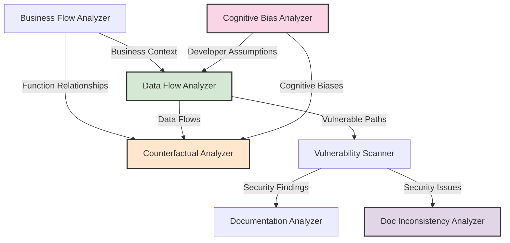

# Analysis Components

## Overview

The Finite Monkey Engine includes several specialized analysis components that work together to provide comprehensive smart contract security assessment. Each component focuses on a specific aspect of contract security, and they share information to provide deeper insights.

## Component Details

### 1. Data Flow Analyzer

**Purpose**: Identifies potentially exploitable paths from user-controlled inputs (sources) to vulnerable operations (sinks).

**Key Features**:
- Source identification (user inputs, transaction data)
- Sink identification (external calls, state changes)
- Taint propagation tracking
- Control variable analysis
- Business context integration

**Output**:
- Source-to-sink paths with exploitation potential
- Path details including code snippets
- Affected business flows
- Exploitability scores

### 2. Cognitive Bias Analyzer

**Purpose**: Identifies cognitive biases in the contract code that could lead to security vulnerabilities.

**Key Features**:
- Optimism bias detection
- Anchoring bias detection
- Confirmation bias detection
- Authority bias detection
- Status quo bias detection

**Output**:
- Identified biases with locations and descriptions
- Developer assumption analysis
- Cross-contract bias patterns
- Recommendations for addressing bias-related issues

### 3. Documentation Analyzer

**Purpose**: Evaluates the quality, completeness, and security relevance of contract documentation.

**Key Features**:
- NatSpec compliance checking
- Documentation-to-code ratio calculation
- Function documentation assessment
- Security documentation evaluation

**Output**:
- Documentation quality scores
- Strengths and weaknesses analysis
- Recommended documentation improvements
- Security-relevant documentation gaps

### 4. Documentation Inconsistency Analyzer

**Purpose**: Identifies mismatches between code comments and actual implementation that could indicate security issues.

**Key Features**:
- Code-comment pairing
- Functional mismatch detection
- Security implication analysis
- Outdated documentation identification

**Output**:
- Inconsistency findings with severity ratings
- Security impact assessments
- Recommended comment updates
- Code snippets with inconsistent comments

### 5. Counterfactual Analyzer

**Purpose**: Generates "what if" scenarios to identify potential security vulnerabilities under different conditions.

**Key Features**:
- Parameter extreme value analysis
- State divergence analysis
- External call failure scenarios
- Transaction ordering attack scenarios
- Permission change vulnerability detection

**Output**:
- Counterfactual scenarios with descriptions
- Detailed exploit paths
- Required attack conditions
- Technical difficulty assessments
- Mitigation recommendations

## Integration Between Components

The components share information to enhance their analyses:

## LLM Integration

Each analyzer uses LLM prompts that incorporate findings from other analyzers to provide more context-aware and comprehensive analysis. For example:

- Data flow analyzer incorporates business flow and cognitive bias information
- Counterfactual analyzer includes data flows and business context in its prompts
- Documentation analyzer considers identified vulnerabilities when evaluating documentation quality

This cross-component information sharing enables the system to identify complex security issues that might be missed by analyzing each aspect in isolation.
