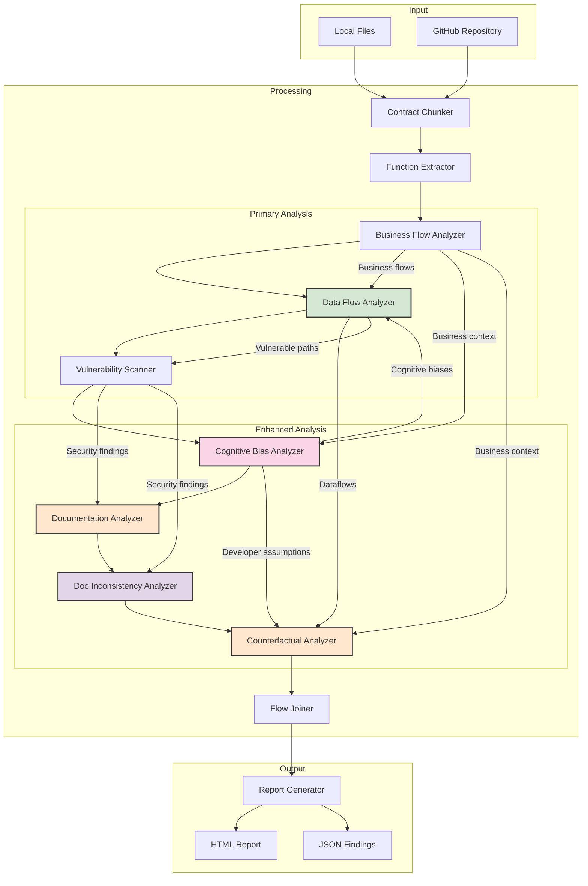

# Analysis Flow Chart

This chart illustrates how information flows through the different analyzers and how findings are shared between components.

## Information Sharing Between Components

Each analyzer shares its findings with other analyzers to provide deeper insights:

1. **Business Flow Analyzer** → **Data Flow Analyzer**
   - Provides business context for data flows
   - Helps identify high-impact paths

2. **Data Flow Analyzer** → **Counterfactual Analyzer**
   - Shares vulnerable data paths
   - Informs "what if" scenarios

3. **Cognitive Bias Analyzer** → **Data Flow Analyzer**
   - Shares identified biases affecting code paths
   - Helps assess exploitability

4. **Vulnerability Scanner** → **Documentation Analyzer**
   - Provides security context for documentation evaluation
   - Highlights under-documented vulnerable areas

5. **All Analyzers** → **Report Generator**
   - Comprehensive findings integration
   - Cross-referenced security insights
